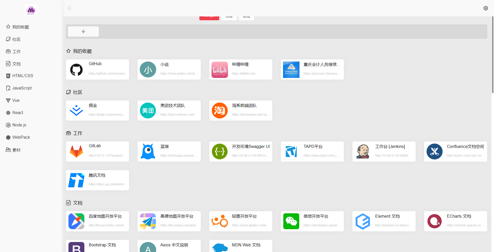

# My Navigation

一个简单的书签管理页面，支持拖拽分类。

## 1. 安装 Project setup
```
npm install
```

## 2. 运行 Compiles and hot-reloads for development
```
npm run serve
```

## 3. 打包 Compiles and minifies for production
```
npm run build
```

## 4. 运行效果

### 主页面

