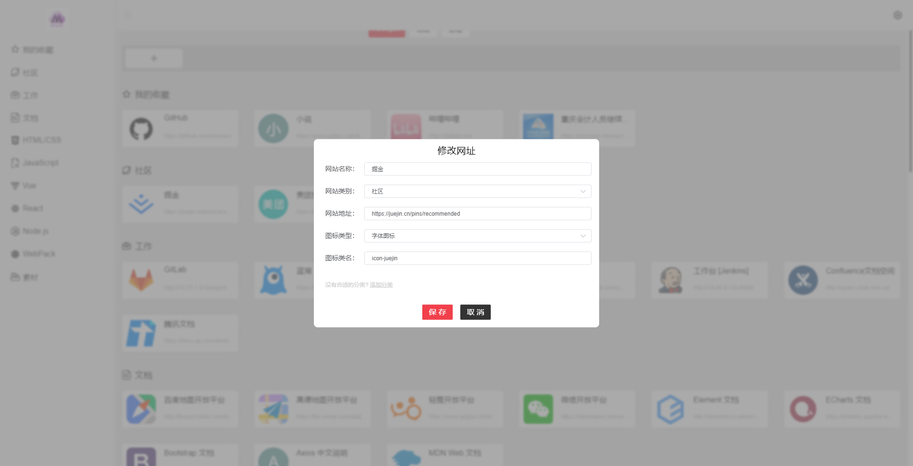
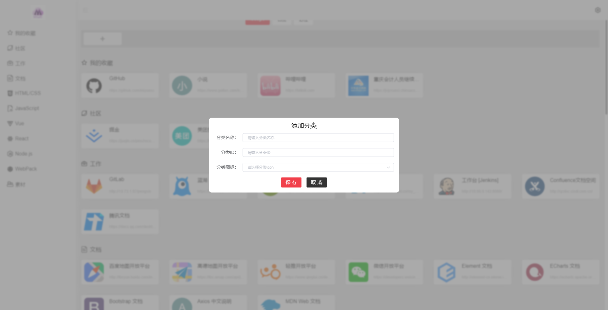
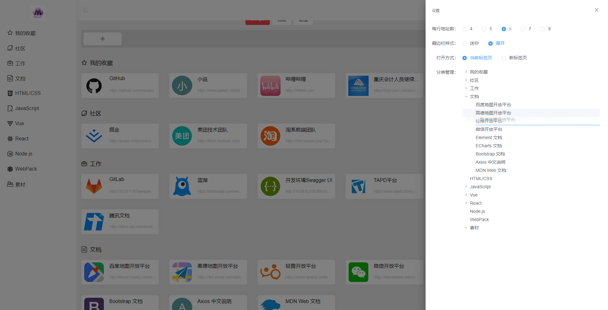
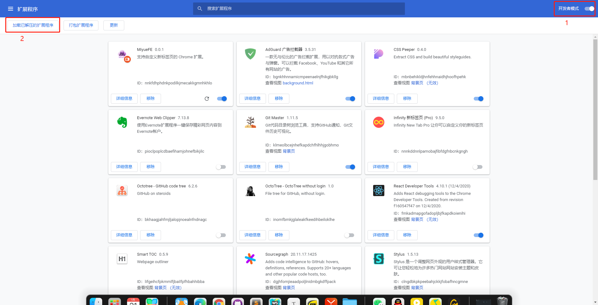
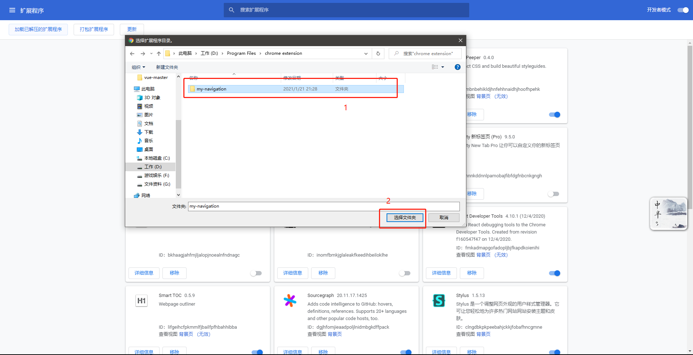

# My Navigation

一个简单的书签管理页面，支持拖拽分类。

## 1. 安装 Project setup
```
npm install
```

## 2. 运行 Compiles and hot-reloads for development
```
npm run serve
```

## 3. 打包 Compiles and minifies for production
```
npm run build
```

## 4. 运行效果

### 主页面


### 添加/修改书签



### 添加分类



### 页面设置



## 5. 使用方式

将项目打包后，复制 `dist` 目录下的打包内容到自己喜欢的文件夹中。

之后在 `Chrome` 的扩展程序页面，使用"开发者模式"，之后选择"加载已解压的扩展程序"，找到对应的文件夹，点击确定。



